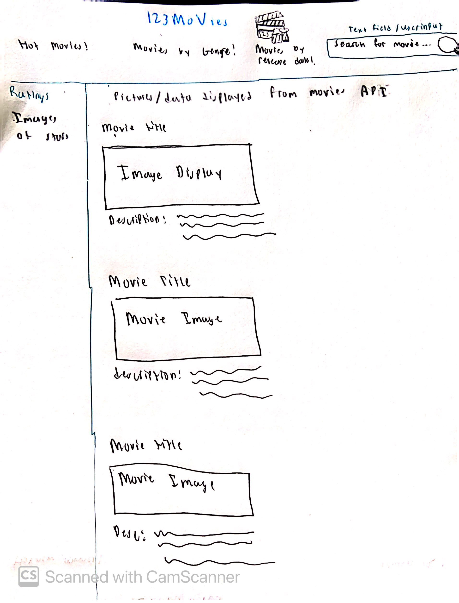

# **123MoVies**

## Table of Contents

1. [App Overview](#App-Overview)
1. [Product Spec](#Product-Spec)
1. [Wireframes](#Wireframes)
1. [Build Notes](#Build-Notes)

## App Overview

### Description 

**A movie app, a social media app, and a way to rate your favorite movies! With our app you can see who else is going to see a movie and make new friends at your favorite theater or step out of your comfort zone and explore new genres of movies you haven't seen yet. You can rate movies you've watched, and see what others thought of your favorite film!**

### App Evaluation

<!-- Evaluation of your app across the following attributes -->

   - **Description**: Allows individuals to see upcoming movie releases, highest grossing movies, and top rated movies this week, month, and year.
   - **Category:** Social Networking
   - **Mobile:** This works very well as a mobile ap as you can link it to your favorite thater and automatically see what new movie relases are out and the reviews so you can plan the perfect date, friend hangout, or simply watch a movie alone!
   - **Story:** With a potential social media feature you can see who else is going to see a movie and make new friends at your favorite theater or step out of your comfort zone and explore new genres of movies you haven't seen yet.
   - **Market:** Any movie lovers with enough storage on their phones! 
   - **Habit:** Include a reward system based on movies watched and reviews uploaded to increase cutomer return rate!
   - **Scope:** V1 would include a way to view upcoming movies, movies out now, and their IMDB scores, V2 would include top trending movies this month and year along with review system, V3 would include a way to socailize with others and a follower system so you can see what movies your friends went to watch without you, and V4 will include a rewards system so people can earn prizes based on movies watched and reviewed.
## Product Spec

### 1. User Features (Required and Optional)

Required Features:

- User can see upcoming movie releases
- User can filter by genre
- User can sort by movie release date
- User can save favorite movies

Stretch Features:

- **User can review movies**

### 2. Chosen API(s)

(https://api.themoviedb.org/3/movie/550?api_key={api_key})

### 3. User Interaction

Required Feature

**Movie Database API**

**Get Upcoming: User can search for upcoming movies** 

- Results display based on option chosen

**Get Now Playing: User can search for movies now playing in theaters**

- Results displayed based on location entered and movies currently out

**Get Top Rated: User can sort results by IMDB rating**

- Results displayed sorted by rating

## Wireframes

<!-- Add picture of your hand sketched wireframes in this section -->

## Build Notes

Here's a place for any other notes on the app, it's creation 
process, or what you learned this unit!  

For Milestone 2, include **2+ GIFs** of the build process here!

## License

Copyright **2023** **Jose Mendoza**

Licensed under the Apache License, Version 2.0 (the "License");
you may not use this file except in compliance with the License.
You may obtain a copy of the License at

    http://www.apache.org/licenses/LICENSE-2.0

Unless required by applicable law or agreed to in writing, software
distributed under the License is distributed on an "AS IS" BASIS,
WITHOUT WARRANTIES OR CONDITIONS OF ANY KIND, either express or implied.
See the License for the specific language governing permissions and
limitations under the License.
